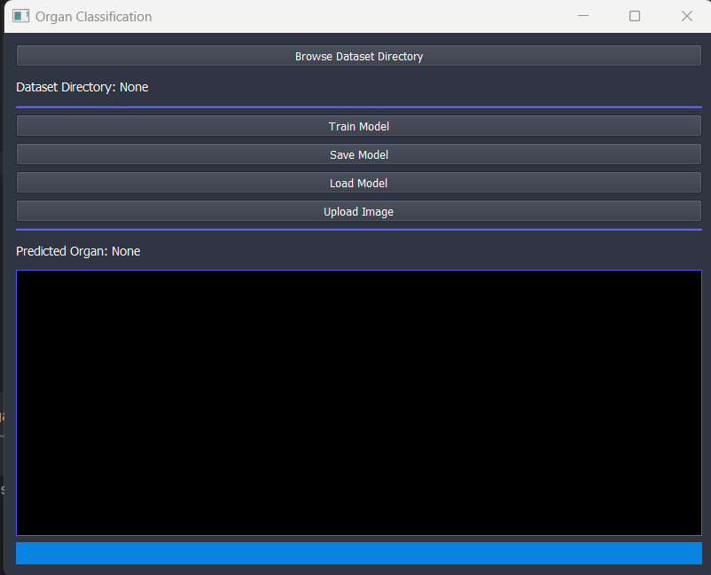
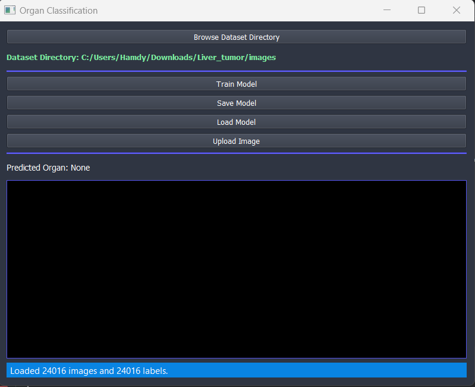
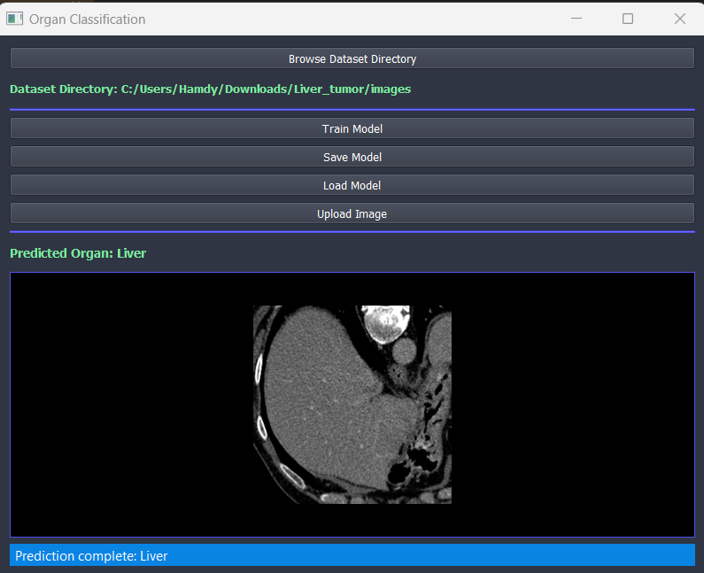
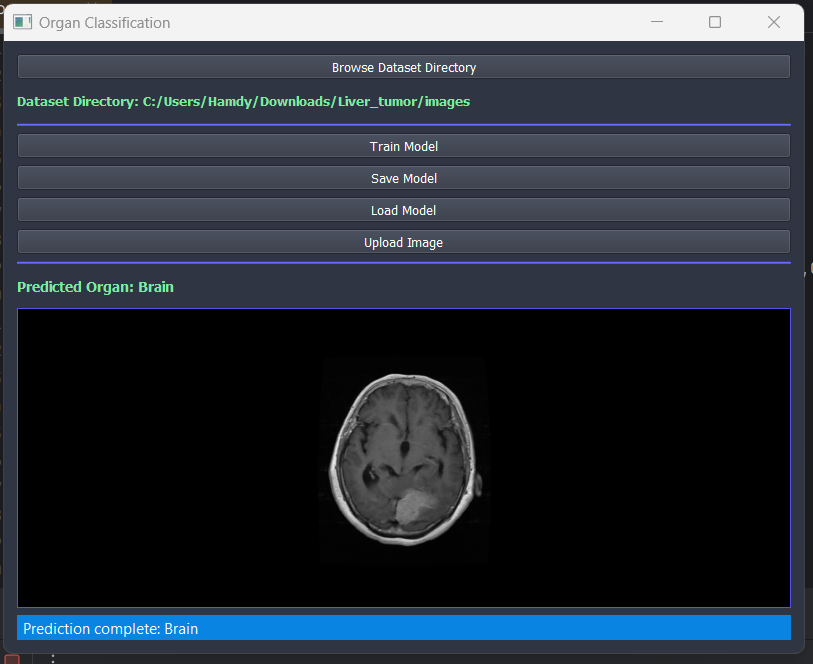

<p align="center">
  <a href="" rel="noopener">
    


</p>
<p align="center">
    <br> 
</p>
<div align="center">

[](https://github.com/hamdy-cufe-eng/Ai-Organ-Identifier/contributors)
[](https://github.com/hamdy-cufe-eng/Ai-Organ-Identifier/issues)
[](https://github.com/hamdy-cufe-eng/Ai-Organ-Identifier/network)
[](https://github.com/hamdy-cufe-eng/Ai-Organ-Identifier/stargazers)
[](https://github.com/hamdy-cufe-eng/Ai-Organ-Identifier/blob/main/LICENSE)

</div>

<details>
  <summary>Table of Contents</summary>
  <ol>
    <li>
      <a href="#about">About The Project</a>
      <ul>
        <li><a href="#tech">Built Using</a></li>
      </ul>
    </li>
    <li>
      <a href="#install">Getting Started</a>
      <ul>
        <li><a href="#install">Installation</a></li>
      </ul>
    </li>
    <li><a href="#start">How to start</a></li>
    <li><a href="#features">Features</a></li>
    <li><a href="#screenshots">Screenshots</a></li>
	<li><a href="#contributors">Contributors</a></li>
  </ol>
</details>


## About

 Advanced Image Viewer with multiple features, 
 Simplified interface for viewing/displaying data .

## 💻 Built Using <a name = "tech"></a>
* 
* 
- [PyQt5]()


## 🏁 Get Started /Installation <a name = "install"></a>
1. **Clone the repository**
```
git clone https://github.com/hamdy-cufe-eng/Ai-Organ-Identifier.git
```
2. **Install Visual Studio Code || PyCharm**


3. **Open the folder in IDE**

4. **install dependencies**
```
pip install 
```

5. **Build the project**


6. **You can run through**


## 📌 How to use <a name = "start"></a>

### Usage :
- After compiling the project , load the dataset directory
- Train or load a pre-trained model
- Upload image for detecting 

## 🎆 Features <a name = "features"></a>

- Train or Load a pre-trained model
- Save the current trained model
- Ability to Identify organs using a CT-SCAN (** Brain , Liver, Limbs, Heart **)
- Acheiving accuracy of 98% !
- Responsive status bar
- Modern Flat-UI 

## 📷 Screenshots <a name = "screenshots" ></a>

<div name="Screenshots" align="center">
   
   <hr>
    
    <hr>
  
   
   <hr>
   
   <hr>
</div>

## Contributors <a name = "contributors"></a>
<table align="center">
  <tr>
    <td align="center">
    <a href="https://github.com/hamdy-cufe-eng" target="_black">
    
    <br />
    <sub><b>Hamdy Ahmed</b></sub></a>
    </td>
    <td align="center">
    <a href="https://github.com/Karim-Mohamed-Elsayed" target="_black">
    
    <br />
    <sub><b>Karim Mohamed</b></sub></a>
    </td>
     <td align="center">
    <a href="https://github.com/David-Amir-18" target="_black">
    
    <br />
    <sub><b>David Amir</b></sub></a>
    </td>
    
  </tr>
 </table>
